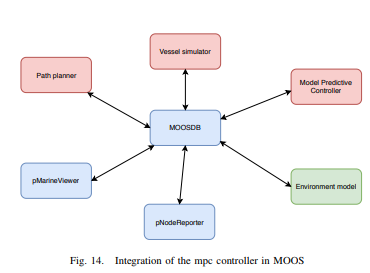

# MoosDemoMPC
A MPC controller integrated into MOOS-IVP.
The steering is done using a rate-of-turn (ROT) and not the rudder angle!

# Overview


As can be seen on the figure above the MPC is integrated with the MOOS-DB.
The red blocks are own work.
The green blocks are situational and can be programmed pretty easily such that the vessel simulator will take environment into consideration.
The blue blocks are used from the moos-ivp (http://oceanai.mit.edu/moos-ivp/pmwiki/pmwiki.php?n=Main.HomePage) modules.

# Getting started
First it is necessary to install MOOS-DB onto your system. This can be done by downloading the source from he following link: http://oceanai.mit.edu/moos-ivp/pmwiki/pmwiki.php?n=Site.Download.
The source contains a readme with the steps necessary to get a working MOOS-DB.
When that's done this project can be started using ```pAntler alpha.moos```.
NOTE: Make sure to install the necessary packages using the pip install command!


# Models
The mpc can make use of three different models.
A rotdot model, a blackbox model and a mathematical model.
The first one approximates one parameter of the mathematical model using ML. The second one approximates all the parameters of the mathematical model using ML.
It is clear the math model performes the best, followed by the rotdot model and then the Black box model.

# Interchanging the models
To change the models that the MPC is using two things need to be changed in the scripts.
First of all you should change the method in mpcMoos.py that does the simulation in the on_vessel_state callback. Optimize_simple uses the mathematical model. Optimize_simple_MLP_rotdot_batch uses the rotdot model and optimize_simple_MLP_batch uses the black box model. When interchanging between the rotdot model and the black box mode, the boolean 'rotdot' in mpc.py should be changed accordingly.
All the batch methods do have their non batch version aswell, these methods give a worse performance since the data is not batched for predictions.


# Simulations
In the state right now the rotdot model and the mathematical model perform the same on the given example with a prediction horizon of 120 and a heading weight of 5.
The black box model is not good enough and thus cannot follow the path with the tuning parameters above.
If we change the prediction horizon to 20 instead of 120 we can see that the path can be followed. There is one oscillation that appears in the first turn. The reason for that is that the model is not trained well enough and thus contains errors.
The reason that lowering the prediction horizon gives a better result for the black box model is because the model contains too much errors, so when we simulate longer the error increases and thus the actions we become from the simulations are biased.

# Conclusions
This PoC shows that it is of great importance to find a good model of a vessel to obtain good results. Even when the model is not perfect the controller can be tuned in such a way that path following is achieved.
An interesting approach for obtaining a model could be to start from the mathematical model and using transfer learning improving that model for real vessels. For this approach it is necessary that there is enough qualitative data.
